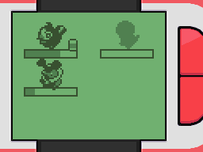
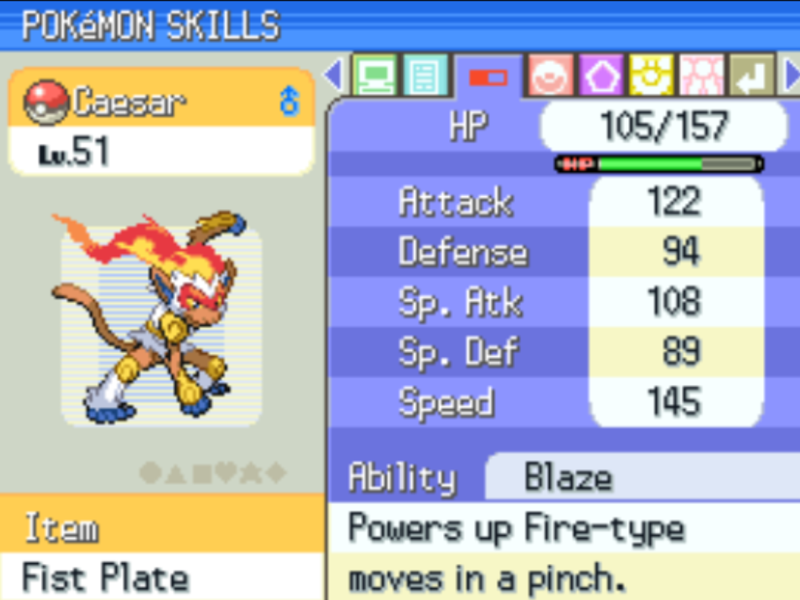
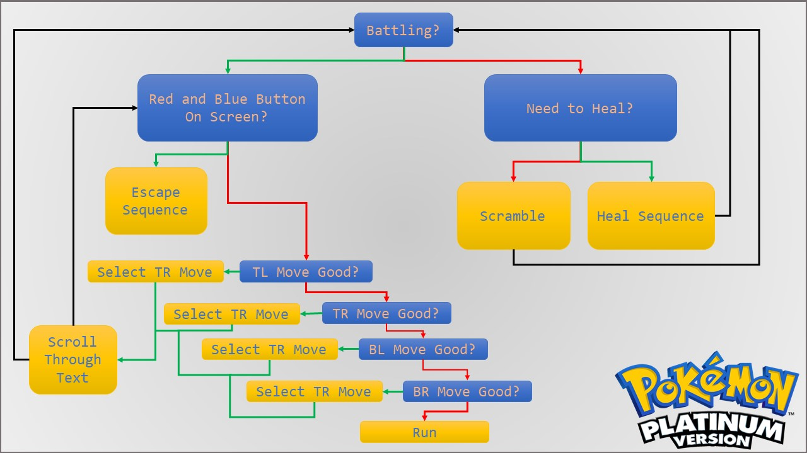
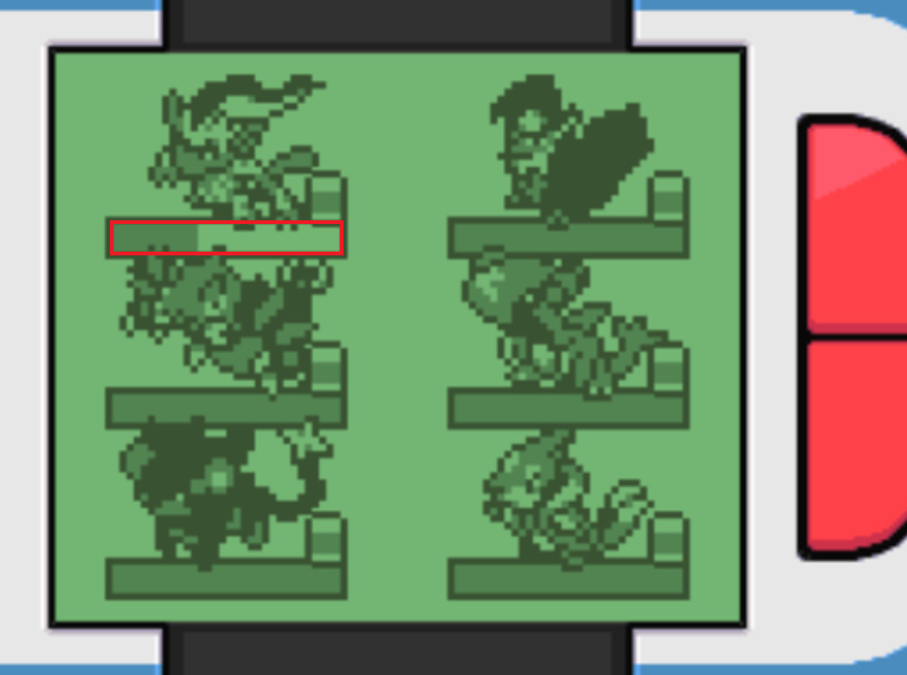
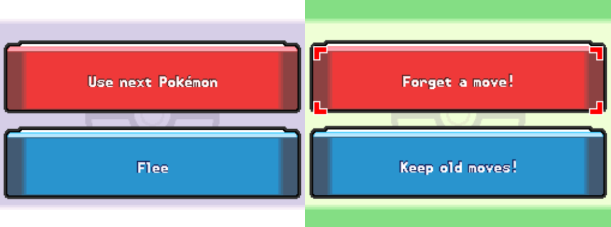

# PokéBot
PokéBot is a Lua-based bot run through the Desmume emulator used for fighting wild Pokemon. It uses the Lua scripting services found in the emulator to analyze the screen and make according inputs. It also has a read and write to file feature for running what are referred to as "sequences", or a series of frame-by-frame inputs. This is the basis for how a TAS (Tool-Assisted Speedrun) works.

## Setup

Because of how the Lua functions are defined, the script has no access to the top screen, only the bottom screen. Anything that can't be found from the bottom screen is found in memory. Finding values in memory, however, is very difficult, as there is little to no documentation on what values are what and values are encrypted and shuffled around in memory. Luckily, other players have shared what they have found online and a few useful values were collected. Because of the limitations of the lack of access to the top screen and the difficulty finding values in memory, the player must set the game up in a certain way in order for the bot to work. First, the player must have the Pokemon List app open in order to determine whether the player must go to the Pokemon Center.

   
 

Secondly, certain actions performed when recording sequences must be undone (ie. switching back to original bike gear when shifting, moving the cursor back to the top of the menu, etc.) in order to prevent errors when repeatedly running the sequence. The sequence is just a list of inputs to give to the emulator, played without any knowledge of the actions actually occurring in the game. Sequences are recorded by running <b>recordSequence.lua</b>. Recording starts when the player gives an input and ends when the player presses the select button. All the inputs for a frame are printed line by line to a file <b>return.sqnc</b> which is read later by <b>controls.lua</b>. In PokéBot, the sequence the user must record is the one to be run when the battling Pokemon is out of health. This generally entails flying to a nearby town, healing at the Pokemon Center and running back to the training spot. This is recommended to be kept to just running, not using the bicycle, as the gear may change between sequences and make them inconsistent.

Lastly, the moves the Pokemon uses must be ordered top to bottom in the moves summary when the Pokemon is selected in the roster. The bot selects a move to use in order from top left, top right, bottom left, bottom right, switching only when the current move has run out of PP. When the Pokemon runs out of PP, it will Struggle until its health is low enough to be revived. The moves summary is shown below:

   
 

## Overlay
The program draws a simple overlay onto the bottom screen. Using text, it indicates what state the bot is in. The bot exists in two states: battling or not battling. The overlay also says whether or not the lead Pokemon needs to be healed. Both of these are explained in further detail later. Turning on input display in Desmume also helps to show what the bot is doing, along with looking at the console window.

## Decision Making

Below is a flowchart of the actions the bot takes. 

     

 This flow in code can be found in <b>pokebot.lua</b>. The first thing the bot checks every frame is if the player is battling or in the overworld. It does this by reading from memory (address 022417F4) and checking if it is the designated battle number, meaning the player is battling. This number was found using the RAM Watch and RAM Search features. If the player is not battling, it then checks if the battling Pokemon needs to be healed. This is done by measuring the length of the health bar for that Pokemon to get a rough estimate of its health. If it is greater than 16 pixels long (less than ~25%), the Pokemon is fine and the player will scramble. Scrambling involves looping the scramble function in <b>player.lua</b>, which runs back and forth in the grass until it encounters a Pokemon. The player runs horizontally by repeated holding b and the left and right arrows for a number of frames. If it is below 16 pixels long, the Pokemon must heal and the healing sequence previously recorded will play. The image below outlines which section is checked:

 

   
 

 If the player is battling, it begins by checking if a red and blue button are on the screen. This happen in two cases: the battling Pokemon has just fainted and the player is asked if they want to switch or flee, or the Pokemon has levelled up and the player is asked if it wants to learn a new move. If both are on, the player always presses the blue button, fleeing or giving up on the move. The move can be learned later by going to Pastoria City and trading the Move Tutor a Heart Scale.

 

   
 

If only the red FIGHT button is present (the default battle menu), the bot presses that button then checks the moves of the battling Pokemon. For each move, it checks the color of a pixel in the PP spot to see whether the move has PP or not. If it is gray or yellow, the move is selected and the player mashes the A button to scroll through text faster before the next move or the end of the battle. If the pixel is red, the next move is checked. This repeats for three moves. There is no case where the fourth move does not have PP, because the Pokemon will simply Struggle. The player will keep mashing until the battle ends, the fight button appears or both the red and blue buttons appear.

## Potential Improvement
One source of improvement could be adding user input to the program. Since the Desmume console does not take text input, button presses or touches on the bottom screen can be used to interact with the program. To avoid irrelevant actions from the game running, the emu.frameadvance() function can be called only after all user input is received, meaning all input only occurs in a single frame. An application of this would be for recording sequences. Currently, the user needs to run two files, <b>pokebot.lua</b> and <b>recordSequence.lua</b> to run the entire program. By using user input, the sequence recording can be integrated into the main program (ie. if no file is detected ask the player to record a sequence, else run the sequence). 

Adding more flexibility to the sequence system would benefit the bot. By adding more cases where the bot can act more similarly to a player, the bot can become more efficient than it already is. An instance where this would be useful is healing. Instead of waiting for the Pokemon to die, the Pokemon can be healed using items in battle or out of battle. Also, if it still has PP, a revive could be used instead of center healing. This could also come in handy when the player wants to fight fished Pokemon instead of regular Pokemon, or in general wants a better sequence when finding Pokemon. Working with the bag for repels could also help when training in remote spots. 

Lastly, the bot can be further improved when considering similarities between main-series Pokemon games. The battle system is virtually the same barring minor changes, meaning this bot can be used in other games with some tweaks. One would be pixel locations for the moves to decide whether to use them or not. Using user input mentioned above, the bot can be run independent of the game by having the user select the pixels themselves. Drawing to the screen can ease selection (ie. blowing up the color of the pixel to make viewing easier). Additionally, making the game completely memory-independent by perhaps analyzing the audio for the battle noise (not sure if possible with current Lua functions available) or the screen would help in making the bot more versatile.

## Demonstration

A demonstration of the bot can be found below:

